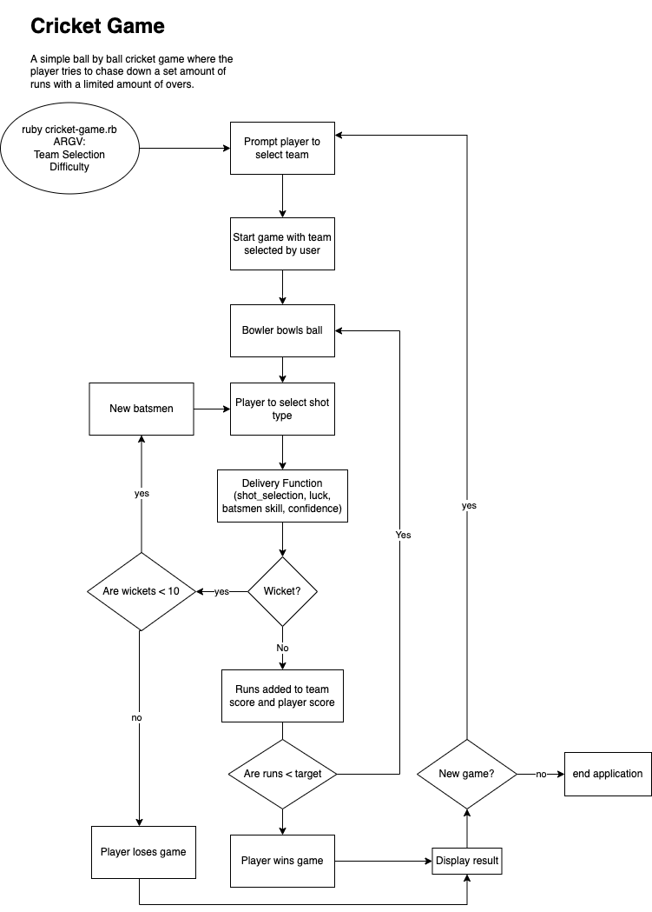
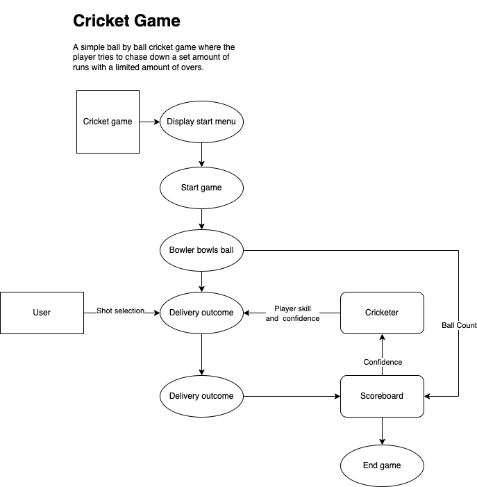
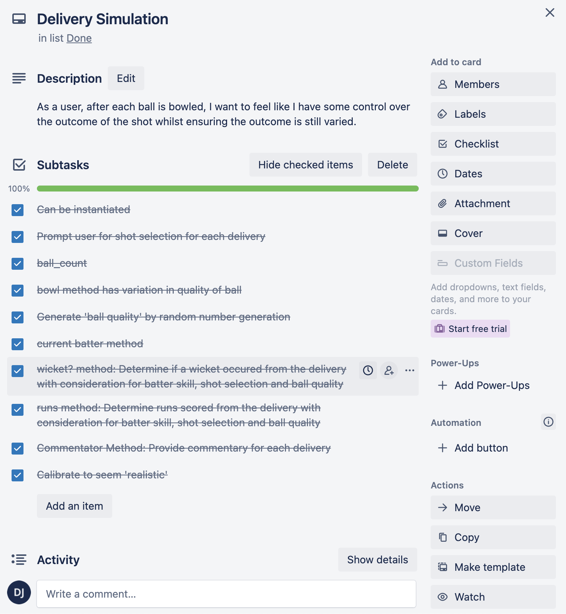

# Ruby Cricket Captain
#### By Damon Johnson

## 1. Description
A cricket game where players aim to chase down the target score within a limited number of overs.
Players must manage the risk vs reward equilibrium of batting in a limited overs format.
Ball by ball players must select a shot and watch the scoreboard climb towards the target score. 

## 2. Features

### 2.1 Customisation of Game Conditions 
Players have the ability to set the length of the game as either 10 overs (standard), 20 overs or 50 overs.
Players have the ability ot change the difficult of the game which determines the target that the player has to chase done to win the game.
Game difficulty and format are changed with command line arguments (See Section 4)
Players have the ability to play as the Australian mens international cricket team or England mens international cricket team.
This can be done at the start of the game in through the in-game menu.

### 2.2 Delivery Simulation
For each delivery of the game, players must select a shot ranging from defensive to very aggressive. Player shot selection, cricketer batting skill and bowling quality are taken in to account to determine the runs scores for each delivery as well as the probability of a wicket occuring. The more aggressive the player manages their batsmen, the faster the player will accumulate runs but the faster they will lose wickets. The challenge of the game is for the player to manage the aggression of their batsmen throughout the innings.After each delivery, the terminal outputs some mock commentary to inform the user of the state of the game. The

### 2.3 Scorecard
At any point during the game, the user can check the scoreboard. The scoreboard provides a table view summary of key game statistics. It is recommended that the player checks the scoreboard to best manage their batsmen.

## 3. Installation Guide
### 3.1 Installation Summary
1. Ensure Ruby version 3.1.0 in installed.
2. Run `bundle install` in the command line from the project directory
3. Run `ruby main.rb` in the command line from the project directory to run the game. See Section 4 for command line arguments.

### 3.1 System/hardware Requirements
Windows or Unix based computer with access to command line terminal.

### 3.2 Dependencies
Ruby version 3.1.0
The program is dependent on the ruby gems displayed Section 3.3.

### 3.3 Ruby Gems
The following gems have been implemented in the program.
"rspec", "~> 3.11"
"tty-prompt", "~> 0.23.1"
"rainbow", "~> 3.1"
"tty-table", "~> 0.12.0"
source "https://rubygems.org"

To read the gemfile and install all dependencies run `bundle install` in the command line from the project directory

## 4. Command Line Arguments
To run the program enter `ruby main.rb` in the command line from the project directory.
This can be altered to include the game length and difficulty.

Length Options (Determines the number of balls of the game):
- 10 overs (default)
- 20 overs
- 50 overs
- 
- Difficulty Options (Determines the target score):
- Easy
- Medium (default)
- Hard

To pass these options in to the program, run the program in the command line from the project directory with the following format:
`ruby main.rb <overs> <difficulty>`
Example:
`ruby main.rb 20 medium`

## 5. Game Instructions
You need to chase down your opponent's score in a limited number of overs.
Before each ball, you will need to select a shot.
1: Defensive shot
2: Balanced shot
3: Attacking shot
4: Very attacking shot
If you play attacking shots you will score faster but there is a higher chance you will be dismissed.
Some batsmen are better than others. To see the batting score of each player select View-Scores'
The instructions can viewed from the in game menu.

## 6. Source Control
Github Repository: https://github.com/DamonJohnson/Cricket-Captain-Game

## 7. Implementation Plan
### 7.1 Concept Flowcharts

)

### 7.2 Feature Checklists
The program was developed in a modular way by implementing the following features. Each feature contained its own checklist of tasks that were then completed.

*Customisation*
- Create unique instances cricketer class for Australian and England national teams.
- Create landing menu that prompts user to select their team
- Allow user to pass command line argument that determines game difficulty
- Allow user to pass command line argument that determine the length of game data
- Converts game difficult argument to target runs and integrates with scoreboard and game format classes
- Options menu passes settings to game control

*Delivery Simulation*
- Prompt user for shot selection for each delivery
- Generate random 'ball quality' by random number generation
- Get batter's skill from current batsman of player's team
- Determine runs scored from the delivery with consideration for batter skill, shot selection and ball quality
- Determine if a wicket occured from the delivery with consideration for batter skill, shot selection and ball quality
- Provide commentary for each delivery
- Pass ball by ball data to the scoreboard
- Calibrate runs and wicket calculation methods to emulate real world cricket

The following screenshots show visual representations of the wicket and runs probaility calibration.
)
)

*Scorecard*
- Track player runs, runrate, wickets, balls
- Track required runs, required runrate, wickets remaining, balls remaining
- Output key game statistics after each delivery
- Allow user to view extended game statistics at any point in the game
- Output statistics summary in table format
- Use scorecard to determine if game is won or lost by user

### 7.3 Project Management
Project Management for the above features, project user stories and general development was carried out in a Trello kanban workspace.

The following screenshot shows the state of the workspace during development of the application.

The following screenshot shows an example of how each feature checklist was managed in trello.

## 8. Code Style Guide
https://rubystyle.guide/ implemented by Ruby Rubocop v0.8.6.

## 9. References
Unit testing by Rspec ruby gem
https://rspec.info/

Coloured text modified by Rainbow ruby gem
https://github.com/sickill/rainbow

Table outputs by tty-table ruby gems
https://github.com/piotrmurach/tty-table

Menu prompts by tty-prompt ruby gem
https://github.com/piotrmurach/tty-prompt